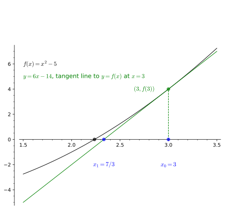

## Introduction to the unit

* These slides at <a href="https://tinyurl.com/calctut01" target="_blank"><code>tinyurl.com/calctut01</code></a>
* Teaching team: Dr Killian O'Brien  
* Let's look at the <a href="https://moodle.mmu.ac.uk/course/view.php?id=183754" target="_blank">Moodle area.</a>

## Some background on $\sqrt{5}$

* Your calculator/computer will tell you that $\sqrt{5}$ is
$$\sqrt{5} = 2.236067977 \dots.$$
* The decimal expansion will go on forever, any finite decimal expansion can only ever be an approximation to $\sqrt{5}$.
* $\sqrt{5}$ is an **irrational** number, i.e. it cannot be given as a ratio of integers, $a/b$, where $a,b \in \mathbb{Z}$.
* In fact, we can show (see the level 5 Number Theory and Abstract Algebra unit) that for every integer $m$, its square root $\sqrt{m}$ will either be an integer itself, or if not, it will be irrational. 
* However, it's also true that any irrational number can be approximate arbitrarily closely by rationals. 
* But in general, to get better and better rational approximations to an irrational, we will need larger and larger denominators.

## Tutorial intro activity

* In this tutorial we will get a first look at the important concept of **convergence of sequences**.
* We'll also see some examples of **proof by induction**. 
* Don't worry if these concepts are new and unfamiliar to you. This is a *first look*. 

### From the APEX Calculus textbook

* Let's quickly read about <a href="https://killianobrien.github.io/apex/output/html/sec_newton.html#idea_Newton" target="_blank">Newton's method</a> for finding roots/zeros of functions.

## Approximating $\sqrt{5}$ with Newton's method and recurrence relations

* We want to approximate $\sqrt{5}$, so we shall consider a function $f$, defined by,
$$f(x) = x^2 - 5,$$
with an initial approximation of $x_0 = 3$. 
* This leads to an **infinite sequence** of values $$x_0, x_1, x_2, x_3,  \dots,$$ with $x_0=3$, satisfying the **recurrence relation**
$$ x_{n+1} = x_n - \frac{x_n^2 - 5}{2x_n}.$$
* This sequence *should* converge to $\sqrt{5}$, i.e. $$\lim_{n \to \infty} x_n = \sqrt{5}.$$
In this tutorial we will work towards a proof of this claim about this sequence.  

## Deriving our recurrence relation

* **Task 1.** Use Newton's recurrence relation 

$$ x_{n+1} = x_n - \frac{f(x_n)}{f'(x_n)},$$
to derive our recurrence relation 
$$ x_{n+1} = x_n - \frac{x_n^2 - 5}{2x_n}.$$

## From $x_0$ to $x_1$

* **Task 2.** Confirm the equation of the first tangent line and confirm the value of $x_1 = 7/3$.

## Establishing a lower bound for our sequence

* **Task 3.** Take our recurrence relation and use it to show that for all $m \geq 1$ we have $x_m > 0$.
* Hints:
    - Rewrite the recurrence in the form 
    $$x_{n+1} = \frac{1}{2x_n} \Big ( \dots \Big )$$
    - Then construct an argument that if $x_n > 0$ then $x_{n+1} > 0$.
    - We can then use *proof by induction* to prove that the sequence is always positive. 

* **Task 4.** Now let's improve the lower bound by showing that for all $m \geq 1$ we have $x_m > \sqrt{5}$.
* Hint:
    - Use the recurrence relation to find a nice expression for $x_{n+1}^2$ of the form 
    $$x_{n+1}^2 = 5 + \Big ( \dots \Big )^2$$
    - Use proof by induction to prove that for all $m \geq 1$ we have $x_m^2 > 5$. 
    - Then use the result of Task 3 to deduce that in fact $x_m > \sqrt{5}$.

## Proving the sequence is decreasing

* **Task 5.** Now prove the sequence is decreasing, i.e. for all $m \geq 1$ we have $x_m > x_{m+1}$. 
* Hint: 
    - Use the recurrence relation to get a nice expression for the difference $x_{n+1} - x_n$. 
    - Use results of earlier tasks to get the decreasing conclusion. 

* **Calling on some theory:** For the next step we'll need to rely on a theorem about the convergence of monotone (increasing or decreasing) bounded sequences. This is <a href="https://killianobrien.github.io/apex/output/html/sec_sequences.html#thm_monotonic_converge" target="_blank">Theorem 9.1.32 in APEX Calculus.</a>

* So now we know our sequence is convergent, i.e. it has a limit. Newton's method claims that this limit should be $\sqrt{5}$.
* **Task 6.** Prove that our sequence converges to the limit $\sqrt{5}$.
* Hints:
    - Take the limit of both sides of the recurrence relation.
    - Use some reasonable assumptions about how limits should behave.
    - Deduce that our sequence converges to $\sqrt{5}$. You will need to argue carefully about the positive or negative square root. 

## Applying our results 

* **Task 7.**
* Now use our recurrence relation to generate a sequence of better and better rational approximations to $\sqrt{5}$. 
* Hint:
    - program the recurrence relation into a Python loop.
